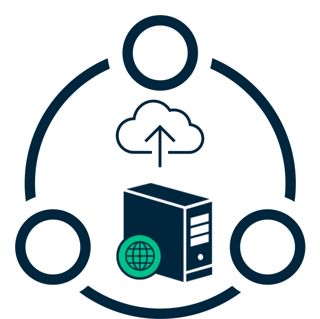

<!-- markdownlint-disable MD033 MD041 -->
<p align="center">

</p>
<h1 align="center">Alteryx Server TypeScript SDK</h1>
<p align="center">
<a href="#getting-started">NodeJS Library for Alteryx Server</a> - <a href="#typescript-sdk">TypeScript SDK</a> - <a href="#development-proxy"> Development Proxy</a>

<!-- markdownlint-enableMD033 -->

[](https://github.com/jupiterbak/ayx-node/actions/workflows/build.yml) [](./LICENSE.md)
[](https://www.npmjs.com/package/@mindconnect/mindconnect-nodejs) 
[](https://lgtm.com/projects/g/jupiterbak/ayx-node/alerts/)
[](https://lgtm.com/projects/g/jupiterbak/ayx-node/context:javascript)
[](https://github.com/mindsphere/mindconnect-nodejs/releases/latest)

</p>

The library comes with the typescript SDK which can be used to access Alteryx Server APIs

[](https://opensource.mindsphere.io/docs/mindconnect-nodejs/sdk/index.html)

It implements support for both frontend (browser e.g. angular, react...) and backend development in node.js.

## Quick Links

| what          | where                                                                                                   |
| ------------- | ------------------------------------------------------------------------------------------------------- |
| documentation | [docs.mongodb.com/drivers/node](https://docs.mongodb.com/drivers/node)                                  |
| api-doc       | [mongodb.github.io/node-mongodb-native/](https://mongodb.github.io/node-mongodb-native/)                |
| npm package   | [www.npmjs.com/package/mongodb](https://www.npmjs.com/package/mongodb)                                  |
| source        | [github.com/mongodb/node-mongodb-native](https://github.com/mongodb/node-mongodb-native)                |
| changelog     | [CHANGELOG.md](https://github.com/jupiterbak/ayx-node/blob/HEAD/CHANGELOG.md)                           |
| contributing  | [CONTRIBUTING.md](https://github.com/jupiterbak/ayx-node/blob/HEAD/CONTRIBUTING.md)                     |
| license  | [LICENSE.md](https://github.com/jupiterbak/ayx-node/blob/HEAD/LICENSE.md)

### Server Core APIs

| Name | AYX Server API Version  | SDK - Client |
| --- | --- | --- |
| Admin Management Tasks |  V1 | :heavy_check_mark: |
| Admin Management Tasks |  V2 | :heavy_check_mark: |
| Collection Management  |  V3 | :heavy_check_mark: |
| Credential Management  |  V3 | :heavy_check_mark: |
| DCME Connection Management  |  V3 | :heavy_check_mark: |
| Usergroup Management  |  V2 | :heavy_check_mark: |
| Usergroup Management  |  V3 | :heavy_check_mark: |
| Job Management  |  V1 | :heavy_check_mark: |
| Schedule Management  |  V3 | :heavy_check_mark: |
| Server Connection Management  |  V3 | :heavy_check_mark: |
| User Management  |  V2 | :heavy_check_mark: |
| User Management  |  V3 | :heavy_check_mark: |
| Workflow Management  |  V3 | :heavy_check_mark: |
| Workflow Management  |  V1 | :heavy_check_mark: |

 
## Installation

The recommended way to get started using the nodejs is by using the `npm` (Node Package Manager) to install the dependency in your project.

After you've created your own project using `npm init`, you can run:

```bash
npm install @jupiterbak/ayx-node
# or ...
yarn add @jupiterbak/ayx-node
```

This will download the this library and add a dependency entry in your `package.json` file.

If you are a Typescript user, you will need the Node.js type definitions to use the driver's definitions:

```sh
npm install -D @types/node
```

## Quick Start

This guide will show you how to set up a simple application using Node.js that allows you to interact with an Alteryx server. Its scope is only to list all the workflows present in your workspace.

### Create the `package.json` file

First, create a directory where your application will live.

```bash
mkdir myProject
cd myProject
```

Enter the following command and answer the questions to create the initial structure for your new project:

```bash
npm init -y
```

Next, install the driver as a dependency.

```bash
npm install ayx-node
```

### Connect to your Alteryx server

Create a new **app.js** file and add the following code to try read all the workflows listed in your workspace.

Add code to connect to the server **myProject**:

> **NOTE:** All the examples below use async/await syntax.
>
> However, all async API calls support an optional callback as the final argument,
> if a callback is provided a Promise will not be returned.

```js
const { AlteryxSdk } = require('ayx-node');
// or as an es module:
// import { AlteryxSdk } from 'ayx-node'

// Alteryx Server REST API Connection URL
const url = 'http://localhost/webapi/';
const clientId = '8DA3C9A7E88FD2Ebe586219847b7f9b5b1bd0f8c31c3b20ca5f2a9ea54e107a173f379128b3b6b1';
const clientSecret = 'cb1d3a6287f0d86e88169963045512be40dd28771c93d404450d0279c743611a';

// Instantiate the library
const sdk = new AlteryxSdk({
    gateway: url,
    clientId: clientId,
    clientSecret: clientSecret
});

// Get the workflow management client. Multiple client are supported as well
const wClient = sdk.GetWorkflowManagementClient();

// List all the workflows in my workspace
const workflows = await wClient.GetWorkflows();

// Print the workflows
```

Run your app from the command line with:

```bash
node app.js
```

The application should print all the workflows of your workspace into the console.

## Proxy support

Set the http_proxy or HTTP_PROXY environment variable if you need to connect via proxy.

```bash
# set http proxy environment variable if you are using e.g. fiddler on the localhost.

export HTTP_PROXY=http://localhost:8888
```

## Change Log

Change history can be found in [`CHANGELOG.md`](./CHANGELOG.md).

## Bugs / Feature Requests

If an API is missing and you would like to contribute a Client for it take a look at [CONTRIBUTING.md](./CONTRIBUTING.md).

## Legal

This project has been released under an [Open Source license](./LICENSE.md). The release may include and/or use APIs to Alteryx’ or third parties’ products or services. In no event shall the project’s Open Source license grant any rights in or to these APIs, products or services that would alter, expand, be inconsistent with, or supersede any terms of separate license agreements applicable to those APIs. “API” means application programming interfaces and their specifications and implementing code that allows other software to communicate with or call on Alteryx’ or third parties’ products or services and may be made available through Alteryx’ or third parties’ products, documentations or otherwise.